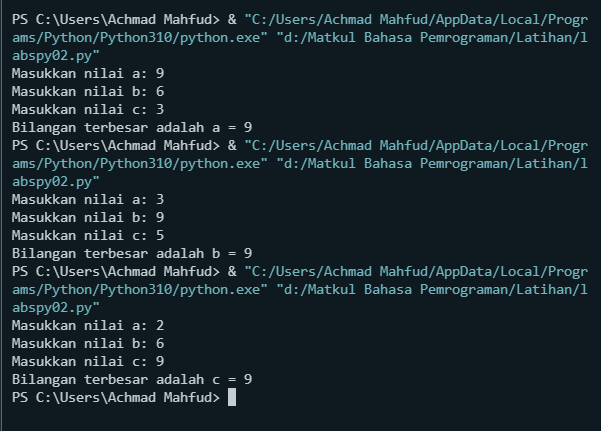

# <p align="center"> **Tugas Praktikum 2**

***Perintah :***
1. Buat repository dengan nama labspy02
2. Buat program sederhana dengan input tiga buah bilangan, dari ketiga bilangan
tersebut tampilkan bilangan terbesarnya. Gunakan statement if.
3. Uraikan langkah atau algoritmanya pada file README.md , sertakan juga flowchart
dan screenshot hasil eksekusi program. Tampilkan 3 kondisi inputan data.
4. Commit dan push pada repository
5. submit url repository pada classroom.

***Program :*** [labspy02](Program/labspy02.py)
```sh
a = int(input("Masukkan nilai a: "))
b = int(input("Masukkan nilai b: "))
c = int(input("Masukkan nilai c: "))
if a > b and a > c:
  print("Bilangan terbesar adalah a =", a)
elif b > a and b > c:
  print("Bilangan terbesar adalah b =", b)
else:
  print("Bilangan terbesar adalah c =", c)
```


***Algoritma Program :***
1. Mulai
2. Masukkan Nilai a, b, c
3. Jika a > b dan a > c maka print a , jika salah print c
4. lalu b > c print b , jika salah print c
5. Selesai


***Flowchart :***


***Output :***

